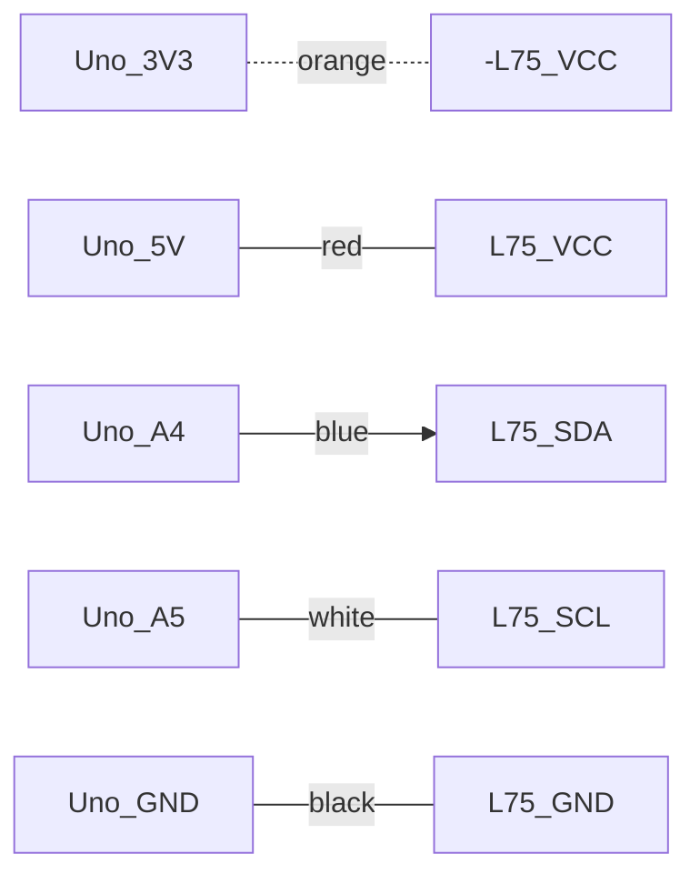
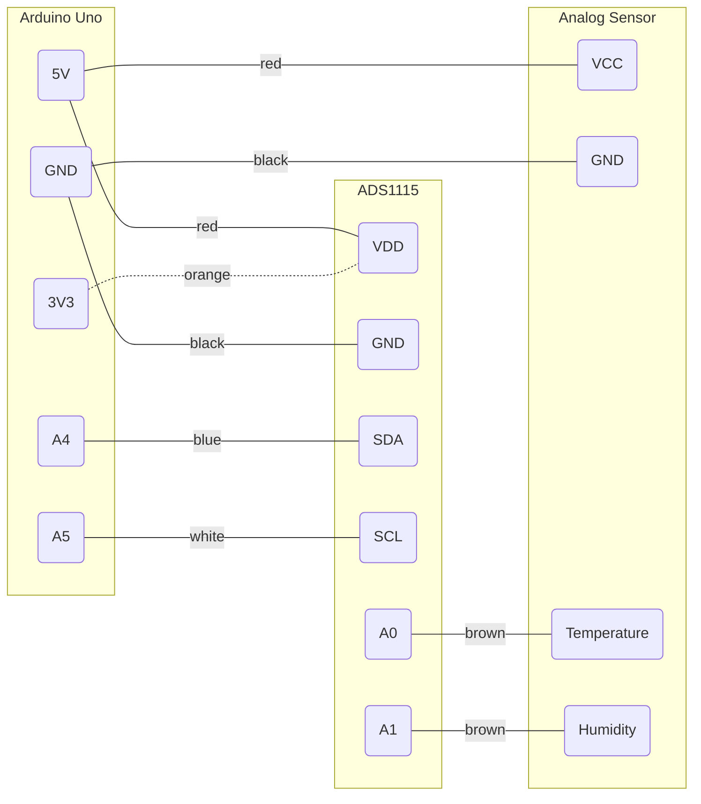

# Wires for Arduino & Co.

| Color  |Voltage  |Signal |I²C|SPI |UART|ISP |
|--------|:-------:|:-----:|:-:|:--:|:--:|:--:|
|red     |+5V      |       |   |    |    |    |
|orange  |+3.3V    |       |   |    |    |    |
|yellow  |+12V     |       |   |    |    |    |
|violet  |any other|       |   |    |    |    |
|black   |GND      |       |   |    |    |    |
|white   |         |Clock  |SCL|SCLK|    |SCK |
|blue    |         |out    |SDA|MOSI|Tx  |MOSI|
|green   |         |in     |   |MISO|Rx  |MISO|
|grey    |         |digital|   |¬SS |    |RST |
|brown   |         |analog |   |    |    |    |

## Example: L75

## Example ADC (ADS1115)

